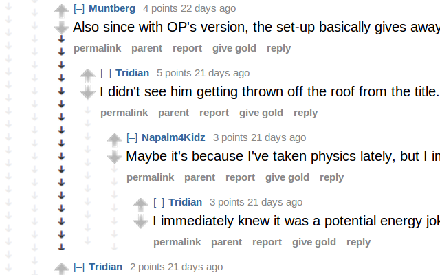
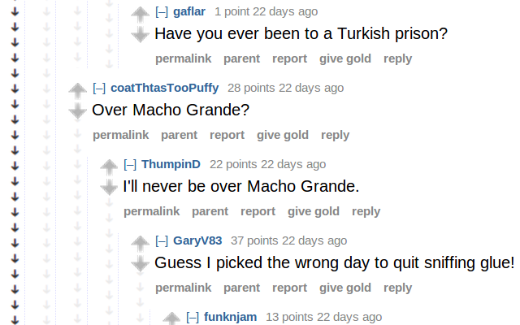

# Reddit Comment Collapser

[Chrome extension](https://chrome.google.com/webstore/detail/reddit-comment-collapser/njmimaecgocggclbecipdimilidimlpl)

[Firefox addon](https://addons.mozilla.org/en-GB/firefox/addon/reddit_comment_collapser/)

---

Reddit Comment Collapser is a more elegant solution for collapsing reddit comment trees.

Collapse a comment and all of it's replies by clicking on the column of the comment you wish to collapse.

No longer get stuck in the middle of a huge comment chain - simply select the outermost column to collapse the whole top-level-comment.

## 

> [!NOTE]  
> There are currently two separate versions of this extension - manifest V2 and manifest V3.
> Chrome is phasing out manifest V2, so we're forced to migrate to to avoid the extension getting removed. However, the V3 version currently doesn't seem compatible with Firefox, so V2 will be hanging around for a while.
> TL;DR: Chrome = V3, Firefox = V2

## Major Contributors

**Tom Watson** (original author)

- <http://tomjwatson.com>

**Sam A. Horvath-Hunt**

- <https://samhh.com>

## License

Code copyright Tom Watson. Code released under [the MIT license](LICENSE.txt).
