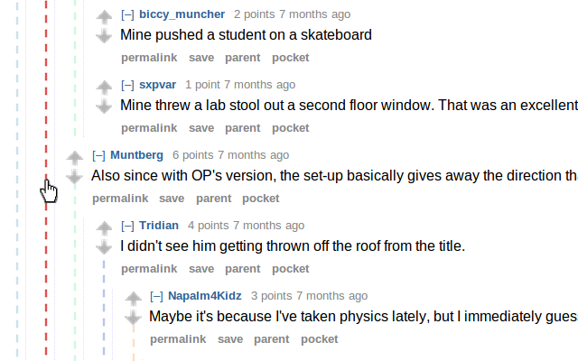
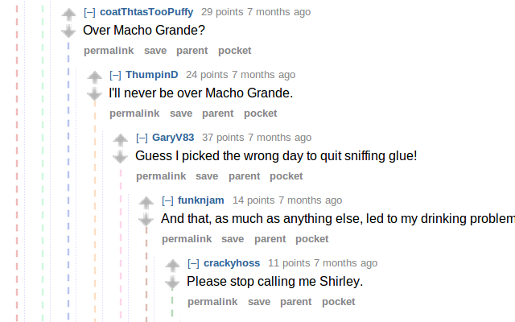

# Reddit Comment Collapser

Reddit Comment Collapser makes it easier to get around long comment threads. It works on both old and new Reddit.

[Chrome extension](https://chrome.google.com/webstore/detail/reddit-comment-collapser/njmimaecgocggclbecipdimilidimlpl)

[Firefox addon](https://addons.mozilla.org/en-GB/firefox/addon/reddit_comment_collapser/)

## Old Reddit

Click the coloured line next to a comment to collapse it and all of its replies. You can also click one of the outer lines to collapse a parent comment without having to scroll back up and find it.

The collapsed comment stays at the top of the screen, so you don't lose your place.

## New Reddit

New Reddit already has buttons for collapsing comments. However, if you collapse a large thread, you can end up much further down the page than you were before.

Reddit Comment Collapser keeps the comment you collapsed on screen.

## Options

You can turn smooth scrolling on or off. On old Reddit, you can also choose how the comment lines look.

## Development

Load the repository root as an unpacked extension. Run `make` to create `reddit-comment-collapser.zip`.

## Major Contributors

**Tom Watson** (original author)

- <http://tomjwatson.com>

**Sam A. Horvath-Hunt**

- <https://samhh.com>

## License

Code copyright Tom Watson. Code released under [the MIT license](LICENSE.txt).
